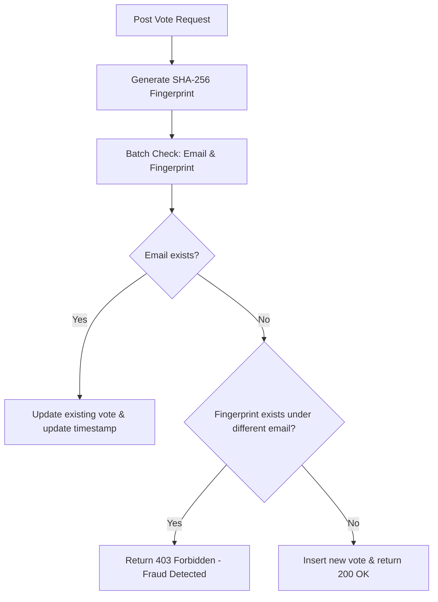

# QuesaRave AI Developer Handover (AGENTS.md)

Welcome, AI Agent! If you are assigned to maintain, extend, or debug this project, this document will help you understand the codebase architecture, design choices, known gotchas, and database schemas.

---

## ⚡ Tech Stack & Architectural Map

This is an ultra-lightweight, high-performance web application designed to run on the **Cloudflare Edge network**.

* **Frontend:** [Astro 6](https://astro.build/) (configured for SSR / Server output).
* **Interactivity:** [Preact](https://preactjs.com/) (used for the `VoteForm` interactive island).
* **Styling:** [Tailwind CSS v4](https://tailwindcss.com/) (using `@tailwindcss/vite` plugin, configuration via CSS `@theme`).
* **Backend:** [Cloudflare Workers](https://workers.cloudflare.com/) (endpoints embedded as server-rendered routes in Astro).
* **Database:** [Cloudflare D1](https://developers.cloudflare.com/d1/) (Serverless SQLite).

### File Map
* Database migrations: [schema.sql](file:///c:/Users/muk04/Development/AntigravityProjects/web-quesarave/schema.sql)
* Core CSS & Tailwind Tokens: [global.css](file:///c:/Users/muk04/Development/AntigravityProjects/web-quesarave/src/styles/global.css)
* Global Shell: [Layout.astro](file:///c:/Users/muk04/Development/AntigravityProjects/web-quesarave/src/layouts/Layout.astro)
* Home Page (Mount Point): [index.astro](file:///c:/Users/muk04/Development/AntigravityProjects/web-quesarave/src/pages/index.astro)
* Preact Interactive Form: [VoteForm.tsx](file:///c:/Users/muk04/Development/AntigravityProjects/web-quesarave/src/components/VoteForm.tsx)
* API Endpoint: [vote.ts](file:///c:/Users/muk04/Development/AntigravityProjects/web-quesarave/src/pages/api/vote.ts)
* i18n Translation Engine: [i18n.ts](file:///c:/Users/muk04/Development/AntigravityProjects/web-quesarave/src/i18n/i18n.ts)
* Results Page Dashboard: [results.astro](file:///c:/Users/muk04/Development/AntigravityProjects/web-quesarave/src/pages/results.astro)
* Results Dashboard component: [ResultsDashboard.tsx](file:///c:/Users/muk04/Development/AntigravityProjects/web-quesarave/src/components/ResultsDashboard.tsx)
* Results API Endpoint: [results.ts](file:///c:/Users/muk04/Development/AntigravityProjects/web-quesarave/src/pages/api/results.ts)


---

## ⚠️ Known Gotchas & Version Locking

If you perform dependency updates, keep these critical structural rules in mind:

### 1. Vite Version Locked to v7
Astro 6 uses Vite 7. Using Tailwind CSS v4 or other modern bundler utilities may attempt to resolve Vite 8, causing a severe runtime crash with:
`require_dist is not a function at runInRunnerObject (workers/runner-worker/index.js)`.
We have enforced Vite 7 in `package.json` under the `"overrides"` block:
```json
"overrides": {
  "vite": "^7.0.0"
}
```
**Do not remove this override.**

### 2. Cloudflare D1 Binding Pattern in Astro 6
In Astro 6+ with `@astrojs/cloudflare` v13+, the old D1 database access pattern (`context.locals.runtime.env.DB`) throws a deprecation error. 
The modern and working pattern is:
```typescript
import { env } from 'cloudflare:workers';
const db = env.DB;
```
For maximum runtime safety across dev/preview environments, [vote.ts](file:///c:/Users/muk04/Development/AntigravityProjects/web-quesarave/src/pages/api/vote.ts) implements a dynamic imports approach:
```typescript
let db: any;
try {
  const workers = await import('cloudflare:workers');
  db = workers.env.DB;
} catch (e) {
  // Catch issues in environments that do not fully support the virtual modules yet
}
```

---

## 🛡️ Anti-Fraud Validation State Machine

The backend `POST /api/vote` endpoint implements strict IP + User-Agent SHA-256 fingerprinting. Here is the logic you must maintain:



### Database Representation
Booleans are represented as `INTEGER` (0 / 1) in the D1 SQLite dialect. Make sure to coerce boolean values properly in binds:
```typescript
const satAft = saturdayAfternoon ? 1 : 0;
```
There is no `attendance_status` stored in the database. Attendance is determined implicitly (if at least one date selection is true/1, they are attending; if all are false/0, they are not attending).

---

## 🎨 Visual Specifications & Tokens

Theme parameters are strictly enforced to align with the nighttime electronic music party vibe.

* **Main Background:** `#0B0C10` (pure dark mode).
* **Accent Colors:** Neon Cyan (`#00FFFF`) and Neon Magenta (`#FF00FF`).
* **Submit Button:** A premium, dark styled button (`#002b2b` to `#2b002b`) outlined with an accent border, layered with intense responsive neon shadows (`shadow-neon-btn` / `shadow-neon-btn-hover`).
* **Checkboxes:** Inset shadow glows (`shadow-neon-cyan-inset`) contained inside checked session cards to prevent overflow. Spacing is `gap-3` between options.
* **Visual Effects:** Glassmorphism on the main card (`backdrop-filter: blur(16px)` + transparent white borders).
* **Typography:** `Space Grotesk` for headings/titles, `Inter` for inputs and labels.

---

## 🌐 Multilanguage Support (i18n)

The site supports Spanish (`es`) and English (`en`), defaulting to Spanish:
* The language detection is handled dynamically on load using `navigator.language` context inside `src/i18n/i18n.ts`.
* All user interface strings, transient toasts, validation errors, and API error mappings are translated dynamically on the client.
* The Astro document wrapper renders with `<html lang="es">` by default.

---

## ⚙️ How to Develop Locally

1. Install dependencies: `npm install`
2. Initialize local SQLite: `npm run db:init`
3. Launch development server: `npm run dev`
4. Production build: `npm run build`
